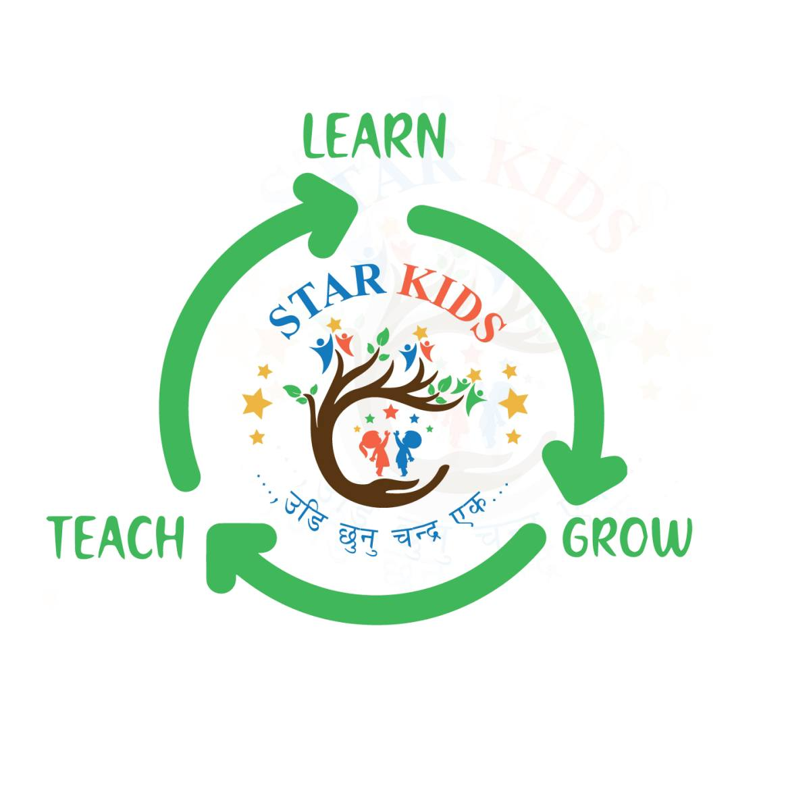
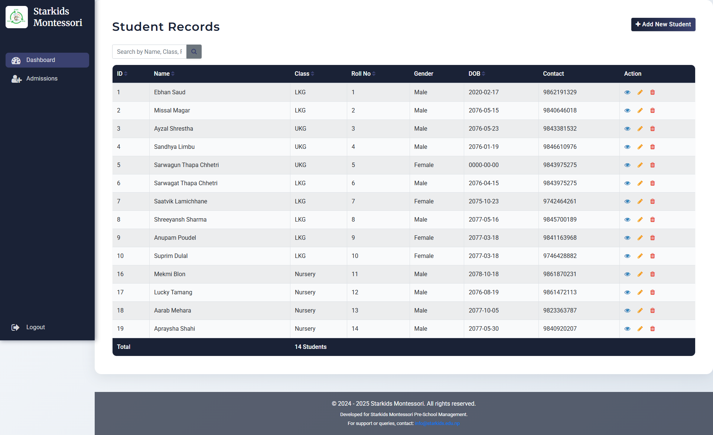
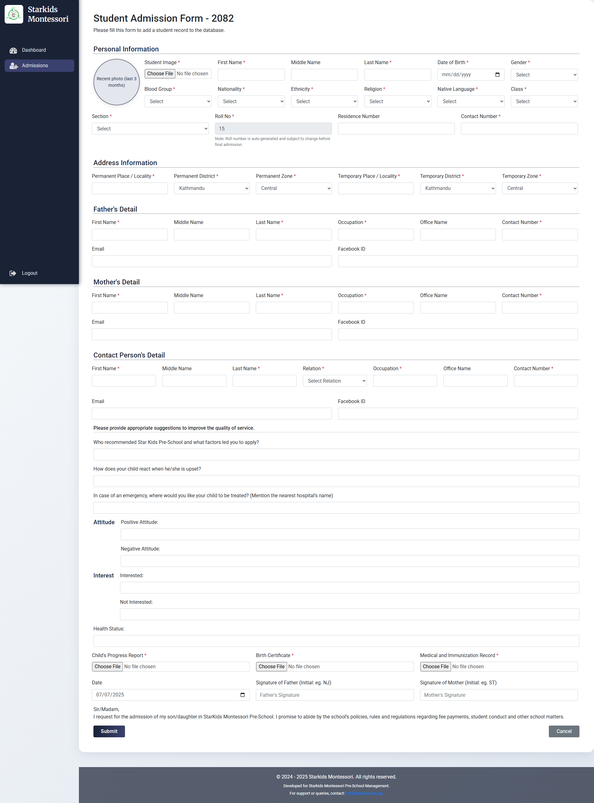
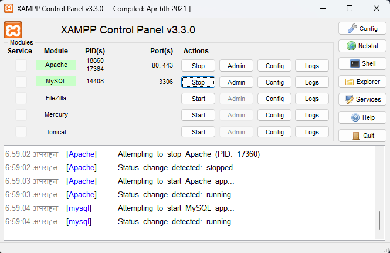
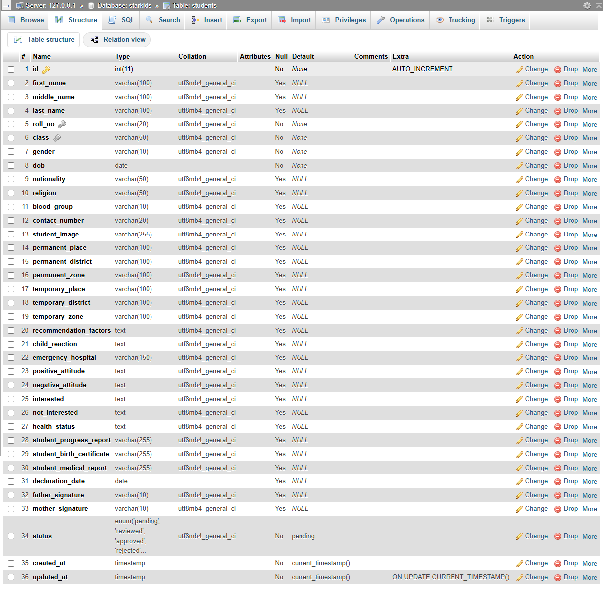
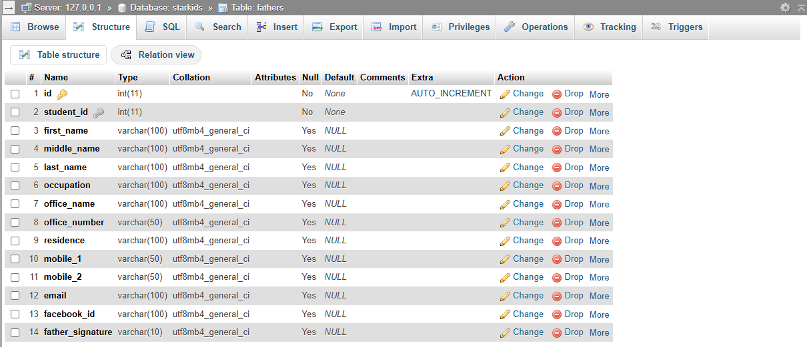
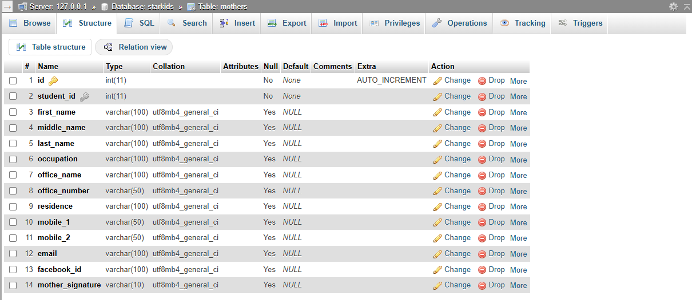
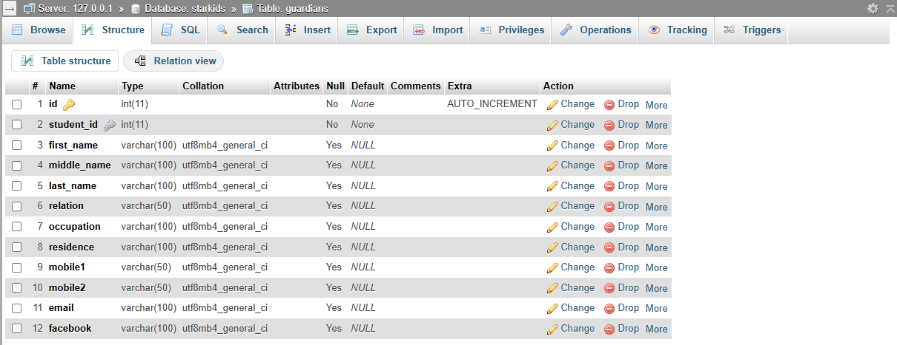
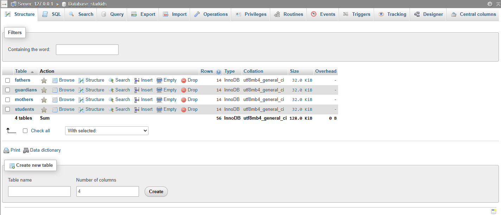

<p align="center">
    
</p>

<h1 align="center">Student Record Management System - Starkids Montessori</h1>

<p align="center"><b>A simple PHP application for managing student records with basic Create, Read, Update, and Delete operations.</b></p>

<br>

<table width="100%">
  <tr>
    <td align="left"><b>Documentation First Created On:</b> 2024/06/14</td>
    <td align="right"><b>Last updated on:</b> 2024/07/07</td>
  </tr>
</table>

<br>

**Main Features:**

- **CRUD Operations:** Easily add, view, update, and delete student records from the database.
- **Simple UI:** Clean and minimal interface for straightforward usage.
- **PHP & MySQL:** Built with core PHP and MySQL for educational and demonstration purposes.
- **Responsive Layout:** Optimized for both desktop and mobile devices.
- **Easy Setup:** Quick installation and local setup.

<br>

<!-- Replace the below section with your screenshots -->
**Screenshots:**

<!-- - _Screenshots will be added soon to showcase the application's features._ -->

<p align="center">
    
    <br>
    <em>Screenshot of dashboard/index.php (data fetched from the database shown below)</em>
</p>

<p align="center">
    
    <br>
    <em>Screenshot of admission.php (student admission form page)</em>
</p>
<p align="center">
    
    <br>
    <em>Screenshot of XAMPP Control Panel showing the version used for running the application</em>
</p>

<p align="center">
    
    <br>
    <em>Screenshot of the <code>students</code> table fields in the MySQL database (shows all columns used for storing student records)</em>
</p>

<p align="center">
    
    <br>
    <em>Screenshot of the <code>fathers</code> table fields in the MySQL database (shows all columns used for storing father details related to students)</em>
</p>

<p align="center">
    
    <br>
    <em>Screenshot of the <code>mothers</code> table fields in the MySQL database (shows all columns used for storing mother details related to students)</em>
</p>

<p align="center">
    
    <br>
    <em>Screenshot of the <code>guardians</code> table fields in the MySQL database (shows all columns used for storing guardian details related to students)</em>
</p>

<p align="center">
    
    <br>
    <em>Screenshot of the <code>starkids</code> database in MySQL showing all tables used in the application</em>
</p>
<br>

---

## 🚀 Getting Started

### Prerequisites

- PHP (>=7.0)
- MySQL
- Web server (e.g., Apache, Nginx)
- git

> [!IMPORTANT]
> Please create pull requests from your feature branch to the main branch.

> [!NOTE]
> For any issues or questions, refer to the documentation or contact the maintainers.

### Setup Steps

1. **Clone the Repository**

    ```bash
    git clone https://github.com/Ningsang-Jabegu/TRA-3-OCS-Starkids-Montessori-Student-Record-Management-System-PHP.git
    ```

2. **Import the Database**

    - Create a MySQL database (e.g., `student_management`).
    - Import the provided `database.sql` file into your database.

3. **Configure Database Connection**

    - Update database credentials in `config.php` or the relevant configuration file.

4. **Run the Application**

    - Place the project folder in your web server's root directory (e.g., `htdocs` for XAMPP).
    - Open your browser and navigate to `http://localhost/TRA-2-OCS-Starkids-Montessori-Student-Record-Management-System-PHP`.

---

## 🛠️ Contributing

- Fork the repository and create your feature branch.
- Commit using [Conventional Commits](https://www.conventionalcommits.org/en/v1.0.0/).
- Push your branch and open a pull request.

---

## 📄 License

This project is licensed under the MIT License.

---

<p align="center"><b>Manage student records with PHP the easy way.</b></p>